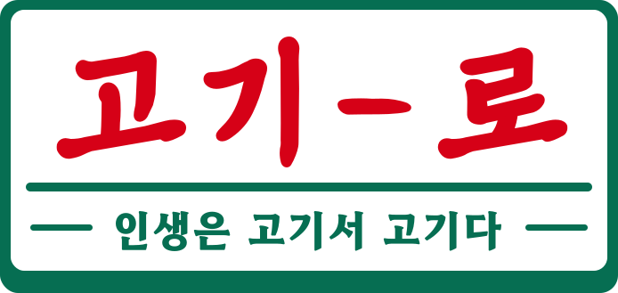

    

 

    
프론트엔드 & 백엔드 협업 프로젝트

    <h4>고깃집 검색 및 예약관리 서비스</h4>
    <h1>고기-로</h1>
    <h2>
        :clapper: 
        Project demo video
    </h2>
    <h3>
       2차 일반유저 시연 영상
    </h3>    
            
        <a href="https://youtu.be/ToPfr4-frgw?si=eXPoT0nfMPvG4nNv" target="_blank">
            🔹 시연영상 바로가기
        </a>
    
  
    <h3>
       3차 가게주인 유저 시연 영상
    </h3>    
            
        <a href="https://youtu.be/OrsRuUjquZY" target="_blank">
            🔹 시연영상 바로가기
        </a>
    
  
    <h3>
       3차 사이트 관리자 시연 영상
    </h3>    
            
        <a href="https://youtu.be/pFxCM4ed72s" target="_blank">
            🔹 시연영상 바로가기
        </a>
    
  
    <h2>
        🌱
         
        Deploy
    </h2>
    <h3>배포</h3>
    
        <a href="http://192.168.0.144:5221/" target="_blank">
            🔹 사이트 바로가기
        </a>
    
    <h2>
        🍀 
        Introduce 
    <h2>
  <h3>
    개요
  </h3>

  <h4>
    :heavy_check_mark:
    인생은 고기서 고기다.
  </h4>
  

    - 고기-로( = gogiro) : 고깃집 로드(road)
  
  
  <h4>
    :heavy_check_mark:
    Persona를 정의한 target 설정
  </h4>
  

    - 고기를 먹고싶어서 식당을 가면 항상 자리가 없어요. 원하는 곳에서 편하게 가고 싶어요
  

  

    - 고기를 먹고싶어서 식당을 가면 항상 자리가 없어요. 원하는 곳에서 편하게 가고 싶어요
  

  

    - 고깃집 가서 고기를 먹었더니 너무 별로였어요 맛있는 고기를 먹고 싶어요
  

  <h4>
    :heavy_check_mark:
    기능 중심의 직관적인 UI
  </h4>
  

    - 마이페이지 내역 확인 
  
  
  <h4>
    :heavy_check_mark:
    TIME / COST
  </h4>
  

    - 고기가 생각날 땐 고기-로 
  

  <h2>
    :calendar: 
    Project period
  </h2>
  <h3>
    프로젝트 기간
  </h3>

  

    🔸 <b> 2차: 23-12-29 ~ 24-02-06</b>
  

  

    🔸 <b> 3차: 24-02-07 ~ 24-03-08</b>
  

  <h2>
    :file_folder: 
    Project info
  </h2>
  <h3>
    프로젝트 정보
  </h3>
    <h3> 🛠️ Tech Stacks </h3>  
    

        
        
        
        
        
         
        
        
        
        
         
        
        
        
        
    

  <h2>
    :running: 
    Members
  </h2>
  <h3>
    멤버 구성
  </h3>

  <h4>
    <b>[Front-end]</b>
  </h4>
    
      <b>황준하(2차 팀장)</b>
       
    
     
    
<b>✔ 담당파트 : </b>

    

     - 일반유저: 커뮤니티(고기잡담) 페이지
    
        
    

     - 가게주인: 매장정보관리
    
        
    

     - 가게주인: 메뉴관리
    
        
    

     - 사이트관리자: 공지사항 등록
    
        
    

     - 프로젝트 구성
    

    

     - 깃허브 관리
    

     
  
      <b>송가람</b>
       
  
     
    
<b>✔ 담당파트 : </b>
    
    

      - 일반유저: 로그인/회원가입
    

    

      - 일반유저: 메인 페이지 
    

    

      - 가게주인: 매장분석 
    

    

      - 사이트관리자: 유저관리 
    

    

      - 사이트관리자: 신고관리 
    

    

      - 회의록 관리
    

     
    
      <b>김솔(3차 팀장)</b>
       
    
     
    
<b>✔ 담당파트 : </b>

    

     - 일반유저: 마이페이지
    

    

     - 가게주인: 예약관리
    
        
    

     - 사이트관리자: 매장관리
    

     - 노션 관리
    
        
    
        
     
    
      <b>손재학</b>
       
    
     
    
<b>✔ 담당파트 : </b>

    

     - 일반유저: JWT/고깃집/정육점 페이지
    

    

     - 일반유저: 결제기능/ 2차 보완(신고,좋아요)
    

    

     - 가게주인: 리뷰관리
    

    

     - 피그마 관리
    
       
           
  <h4>
    <b>[Back-end]</b>
  </h4>
    
      <b>김현수</b>
       
    
     
    
<b>✔ 담당파트 : </b>

    

     - 유저/TDD
    
       
    

     - 총관리자/예약/토스페이
    
       
     
  
      <b>배용진(2차 팀장)</b>
       
  
     
    
<b>✔ 담당파트 : </b>
    
    

      - 가게조회/북마크 기능 
    

    

      - 가게 관리자 
    

     
    
      <b>문하나</b>
       
    
     
    
<b>✔ 담당파트 : </b>

    

     - 예약페이지/예약(픽업)
    

    

     - 고깃집/정육점/유저
    

     
    
      <b>박동현(3차 팀장)</b>
       
    
     
    
<b>✔ 담당파트 : </b>

    

     - 커뮤니티
    
      
           

